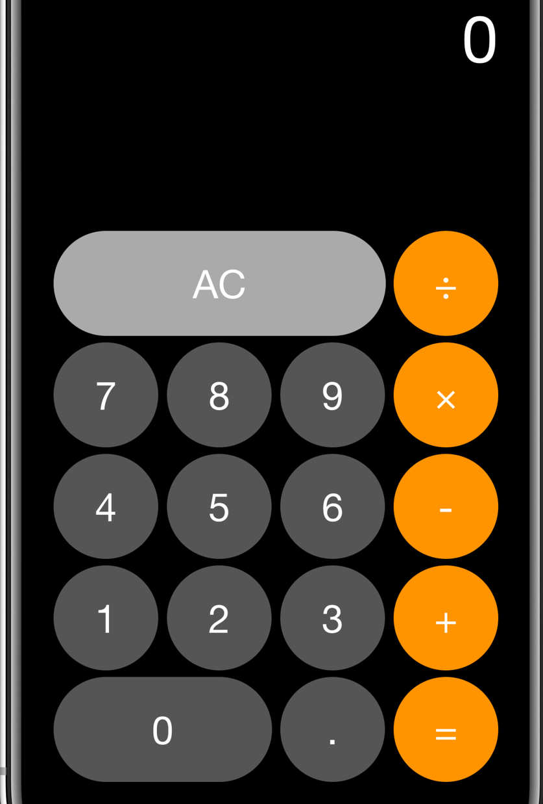

# JavaScript Calculator

This is a simple calculator developed using JavaScript, HTML &amp; SCSS

## Target Image

## Part I MVP

1. Create a calculator to be rendered to the html page
2. It should have number keys from 0 to 9const scope3 = () => { const scope3Var = "123"; }
3. It should have operator keys (+, -, /, \*, =)
4. It should have a display rendering the current calculation in a box at the top
5. It should also have a “.” key

## Implementation

### index.html file has the following

1. A display section with the default text 0
2. A Grid section containing the following :

-   AC : Clear Button
-   Operator keys : +,-,\*,/,=
-   Number keys : 0 to 9
-   . Button to handle decimals

3. The styling of the page is done using SCSS and BEM Conventions
