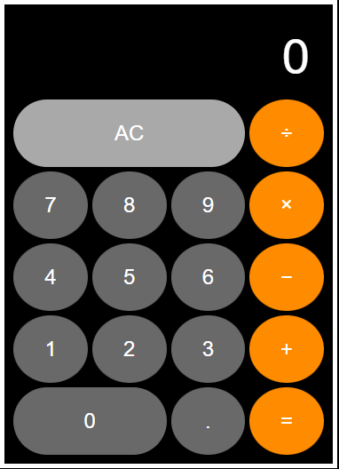

# JavaScript Calculator

This is a simple calculator developed using JavaScript, HTML &amp; SCSS

## Target Image

## Part I MVP

1. Create a calculator to be rendered to the html page
2. It should have number keys from 0 to 9const scope3 = () => { const scope3Var = "123"; }
3. It should have operator keys (+, -, /, \*, =)
4. It should have a display rendering the current calculation in a box at the top
5. It should also have a “.” key

## Implementation

### HTML Implementation (index.html file)

1. A display section with the default text 0
2. A Grid section containing the following :

-   AC : Clear Button
-   Operator keys : +,-,\*,/,=
-   Number keys : 0 to 9
-   . Button to handle decimals

3. The styling of the page is done using SCSS and BEM Conventions

## Part II MVP

1. Should render the current calculation in a box at the top (calculator display)
2. It should handle decimals
3. It doesn’t need to support orders of operation
4. It should not use eval() or Function() constructor

### JavaScript implementation (script.js file)

1. Display shows the default text 0 at the beginning of a calculation.
2. The AC button clears the display and resets it to show 0. (acBtn.addEventListener)
3. Every click on the numerical buttons is passed on and concatenated to form the basis of the expression to be evaluated(digitClick(digit))
4. The operator buttons are passed to a function which does the actual arithmetic calculation based on the display expression.(const result = calculate(initialValue, currentValue, currentOperator))
5. The decimal button turns the numbers into decimal by adding 0.(display.textContent = "0.")

## Actual Image

